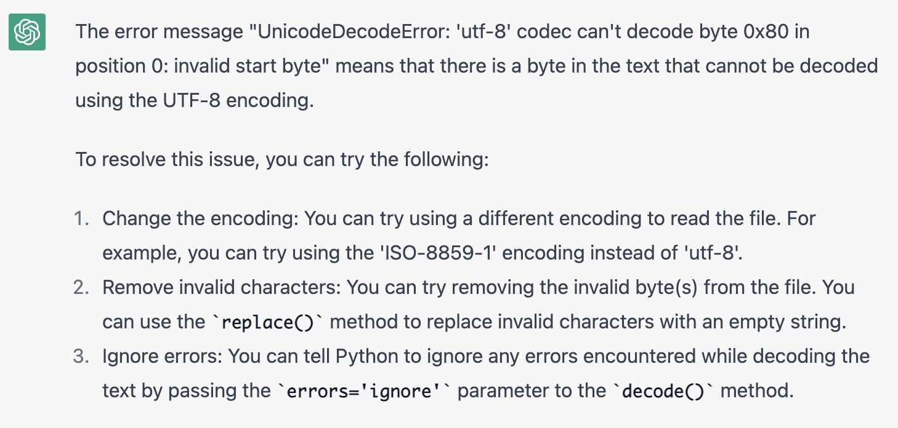

# Text-Analysis-Project by Jenny Ma
 
## Part 1: Project Overview

In this project, I used **Project Gutenberg** and **IMDB Movie Reviews** as my data resources for this project, and I chose *Alice's Adventures in Wonderland* as the source material, and combined it with the book and movie versions for a comprehensive analysis. In the analysis process, I used **pickle, nltk, numpy, fuzzywuzzy, and imdb** to process and analyze the source data. By the end of this project, I expect to have mastered the fundamentals of text and film review analysis, and to be able to make comparisons and draw insightful conclusions based on the results.

## Part 2: Implementation

My analysis consists of two major parts: the text and the film review, with the text serving as the primary analysis and the film review as a supplement. The text analysis is roughly divided into characterizing by word frequencies, computing summary statistics, using Natural Language Toolkit for various types of analysis, and analyzing the similarity between *Alice's Adventures in Wonderland* and other texts; the film review analysis merely derives the sentiment score of the review and allows the user to search whether the review contains a specific word.

In the first phase of text processing, I completed the creation of a dictionary, processed the text, and obtained a frequency-based dictionary, which facilitated the subsequent analysis of the vocabulary. I actually met problems when I tried to open the url of the data source as the error indicated that there was a problem with the SSL certificate veification. I also got UnicodeDecodeError at the beginnig. Problems like this are technical, but ChatGPT helped me to solve the problem:

In the formal analysis, my primary objective was to gain a general comprehension of the text, so I consulted ChatGPT to view the typical text analysis tasks. I determined the most prevalent words and computed the type taken ratio (TTR), which assesses the variety of words used in a text. I originally wanted to do a readability analysis. However, since this is children's literature and there are no other comparable works, a readability analysis makes little sense.

I then began to learn NLTK and used ChatGPT to help me understand what NLTK could accomplish:

I chose sensitivity analysis, POS, and concordance for my analysis, and I wanted to understand the tone of the entire book as well as build a search function to facilitate my finding specific content. During the learning of the new tools, I asked ChatGPT for debugging. For the lines I can't understand, I would keep asking until I fully understand. ChatGPT also helps me improve/simplify my codes, which allows me to program in a effective way. Here are some examples:

However, ChatGPT sometimes offers wrong answers. Therefore, it is very important to have a critical thinking. We need to use our abilities and knowledge to judge ChatGPT's suggestions and figure out how to better refine the solution, rather than just adopting it. Since our projects are relatively large, ChatGPT is often not well identified. We should ask for the new concepts in a general way to learn the concepts first, then trying to figure out how to apply them to our own programs. The following are examples of errors:

After acquiring a basic comprehension of the text, I desired to compare *Alice's Adventures in Wonderland* to other works and identify similarities. Lewis Carroll, the author of *Alice's Adventures in Wonderland,* is one of the few authors who publishes both children's literature and some mathematical work, demonstrating both liberal and scientific thought. Therefore, I searched for other literary works by Carroll as well as mathematical works, as well as works by other authors who also belonged to children's literature and mathematical works, but who typically only concentrated on their respective disciplines. I wanted to determine if authors like Carroll, who are talented in different fields, might exhibit characteristics of one field that are typical of the other, i.e., write literature that is rational and mathematical work that is not entirely neutral. Initially, I intended to draw a graph of similarities, but I discovered that doing so would require a two-by-two comparison of each work and matching scores. Since the texts I selected were in completely different fields and differed significantly, I determined that it would not be meaningful to compare literary and mathematical works, so I abandoned that plan.

As I believed the work had been adapted into a film and there were no reader comments below the text, I wanted to read some film reviews to gain a better comprehension of the work. Surprisingly, ChatGPT offered me an extra method to remove stopwords, which is easier than what I did:

I wrote an equation that generates reviews at random, calculates their sentiment score, and verifies whether they mention the original "novel." This will allow us to determine how readers feel about the story and the film adaptation. Here is an example for asking ChatGPT about the sentiment analysis using NLTK:

## Part 3: Results

Through the analysis of high frequency words, I found that *Alice's Adventrues in Wonderland* does use simple words as children's literature. However, I was expecting that "pos" should be the majority in the sensitivity analysis, but in fact most of them are defined as neutral, which may be related to Correll's own proficiency in mathematics, and he may tend to use neutral descriptions.

By analyzing textual similarity, we can see that *Alice's Adventures in Wonderland* and Carroll's other literary works have similarity scores ranging from 39 to 48. This suggests that his literary works may share common language usage or themes. Intriguingly, Carroll's literary works are more similar to other children's literature, whereas his mathematical works have lower scores. This disparity may be due to the fact that the themes of mathematical works typically involve more diverse fields of study; however, additional research is required to confirm this hypothesis.

In the movie reviews analysis, I was able to read reviews of the book and the movie. I found that most of the viewers had read the book and mentioned the original work. Most of the reviews for the movie are positive, such as "The script has its amusing moments, and the songs and score are sweet and memorable;""There's some added dancing and frolicking about, and Alice seems to be enjoying herself more than she usually does on screen." The film incorporates songs, more like a musical, but I found that the audience had some dissatisfaction with this adaptation. Reviews mentioned "uneven in pace and a little too short, and having one or two tacky costumes(ie. Doormouse)," "these songs are tack-ons. fillers", etc. Most of the audience said the book was better, and the movie was interesting but perhaps the new music added to it made the audience uncomfortable. Here are 5 random movie reviews:

## Part 4: Reflection

**1. Profcess Perspective**

What I did well from a process standpoint was combine two types of data sources to analyze not only the work itself, but also to gather reviews of the work to determine how readers/viewers reacted. This project was difficult and I learned a great deal of new code in the process; when I didn't comprehend something, I looked to ChatGPT to explain it rather than blindly copying it. Due to my lack of technical expertise, I believe this endeavor is imperfect. In the segment of movie reviews, for instance, I can continue to investigate how to filter the most pertinent reviews and compare the strengths and weaknesses of various film adaptations for a more thorough analysis. At the outset of the project, I performed the analysis rather haphazardly and did not organize it rationally using the concept of framework. For instance, I tried out tools such as similarity, but they didn't really work for me and were ultimately purged.

**2. Learning Perspective**

From a learning perspective, this project has improved my comprehension of the processing of various types of text and the application of extremely useful tools such as the Natural Language Toolkit. In addition, I learned how to utilize ChatGPT appropriately. Since this is a very large project with a great deal of back and forth, it is not possible to copy and paste all the code using ChatGPT. This was crucial, as it allowed me to practice communicating with ChatGPT in order to obtain the desired response and transform ChatGPT into a 24-hour teacher. I also discovered that ChatGPT doesn't always provide the right answers, and that it's important to have the ability to differentiate and modify on that basis ChatGPT offered to get better solutions. I wish I had read the questions I'm answering beforehand more carefully, as it would have provided me with a more comprehensive comprehension of the project and a sense of its overall structure, as opposed to focusing solely on its individual functions. This project taught me not only new knowledge and code, but also a new method of thinking and learning.
